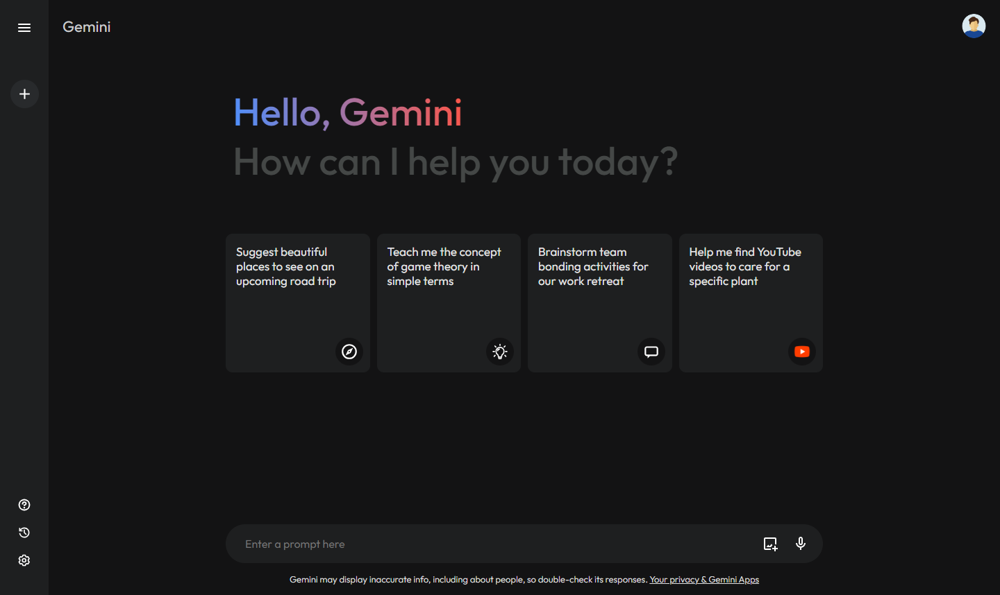

<div align="center">
  
</div>
<h1 align="center">
  Gemini Clone
</h1>
<p align="center">
  Gemini Clone is a React.js web application that replicates the search interface of <a href="https://gemini.google.com/" target="_blank">Google Gemini</a>. This project includes API integration with Google Gemini's language model, allowing users to experience a similar search experience.
</p>
<br />
<a href="https://gemini-clone-with-react.vercel.app/" target="_blank">
  
</a>
<br /><br />
<div align="center">
  Live Demo: https://gemini-clone-with-react.vercel.app/
</div>
<br />

## 🛠 Installation & Set Up

1. Cloning the Repository

   ```sh
   git clone https://github.com/rakhaantareza/gemini-clone.git
   cd gemini-clone
   ```

2. Install the project dependencies using npm:

    ```bash
    npm install
    ```

3. Start the development server

   ```sh
   npm run dev
   ```
